## Q.1.1 Sans changer les adresses IPv4 des 2 machines, montre et explique le résultat d'un ping IPv4 du serveur vers le client.

En utilisant la commande : ipconfig \all sur les deux Vms j'ai obtenu les adresses IP  

Le ping ne fonctionne pas car les deux Vms ne sont pas dans le même réseau : SRV = 172.16.10.0/24 ; client = 172.16.100.0/24  

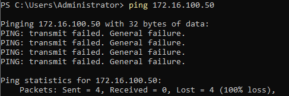

#### Modification de la config IP sur le client pour le mettre sur le même réseau que le SRV : 172.16.10.50

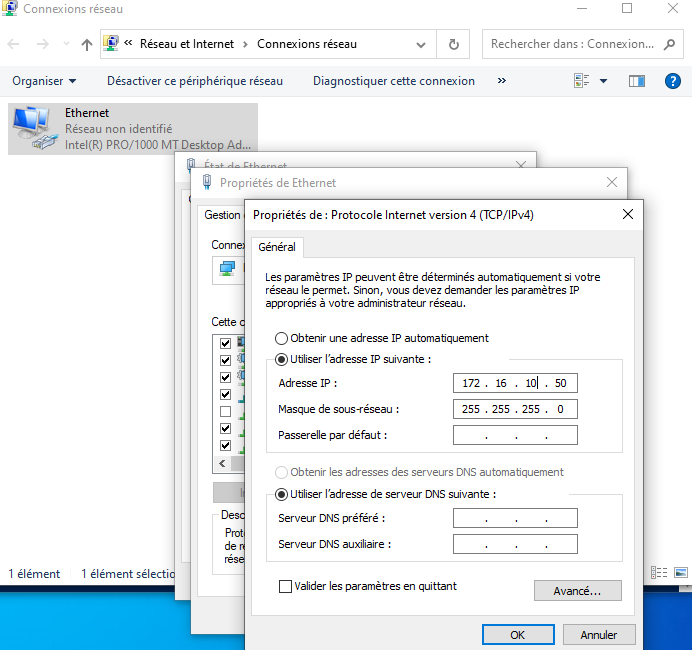

#### Ping fonctionnel

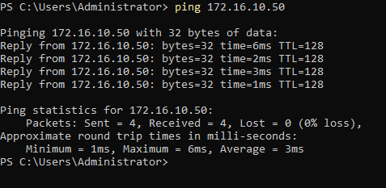

## Q.1.2 Montre et explique le résultat d'un ping du serveur vers le client avec le nom des machines.

### Le ping est fonctionnel car le serveur a résolu le nom de la vm client "Client1" en une adresse ipv6 locale (fe80)

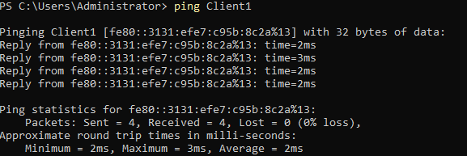

## Q.1.3 
#### Désactive le protocole IPv6 sur le client.

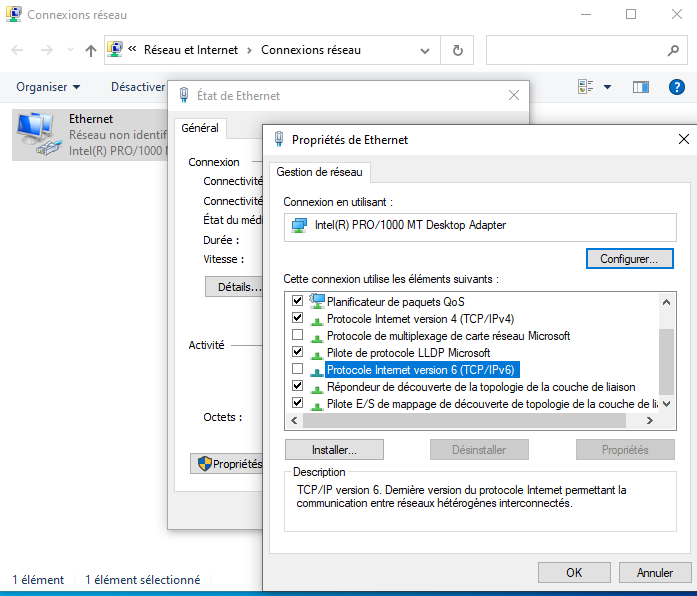

#### Refais un ping avec le nom des machines du serveur vers le client.

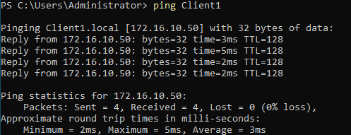

En désactivant le protocole IPv6, le serveur a résolu le nom du client en protocole IPV4, donc ping fonctionnel qui nous retournent l'adresse ipv4 du client 172.16.10.50

### Q.1.4 Change et montre les configurations réseaux sur le client et/ou sur le serveur pour mettre en place le DHCP.

#### SRV config DHCP

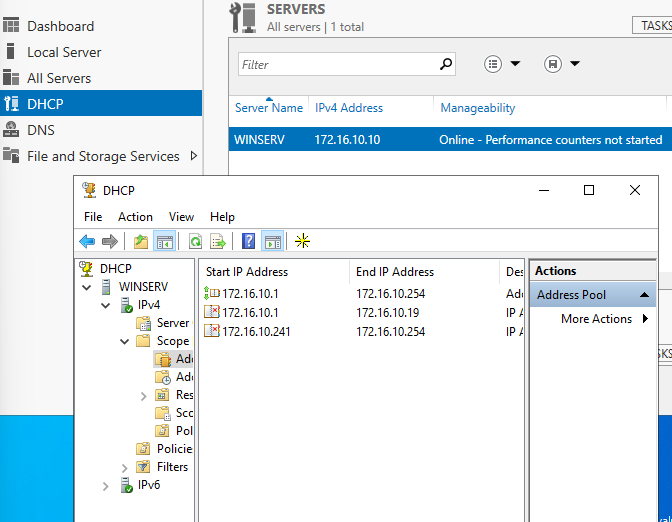

#### Client Config DHCP

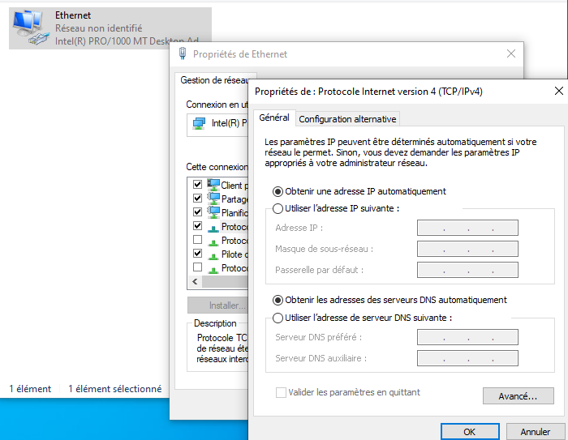

### Q.1.5 Explique pourquoi le client ne récupère pas la 1ère adresse disponible sur cette plage.

Le client ne prend pas la 1ére adresse dispo sur la plage car la config DHCP sur le serveur exlue la distribution des ip entre 172.16.10.1 et 172.16.10.19 ainsi que 172.16.10.241 et 172.16.10.254  

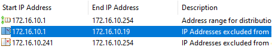

Fais une copie d'écran montrant l'adresse IP prise par le client.

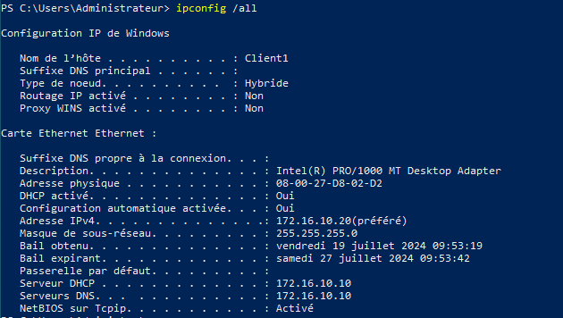

### Q.1.6 Fais une modification sur le DHCP pour que le client ai l'adresse IP 172.16.10.15.

#### En utilisant l'adresse MAC du client, j'ai fait une réservation sur le DHCP  

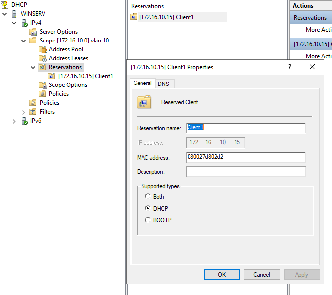

#### Montre tes modifications : j'ai relancer une demande DHCP en redémarrant la carte réseau

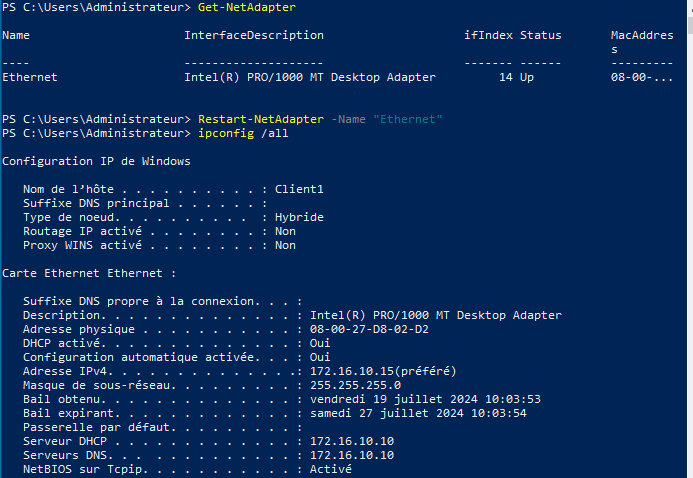  

#### Q.1.7 Au vu de tes manipulations, explique l'intérêt de passer ce réseau en IPv6 ?

Parmi les nombreux avantages de l'IPv6, c'est qu'il permet la configuration automatique des adresses IP sans DHCP

#### Q.1.8 Est-ce que dans ce cas le serveur DHCP est obsolète ?

Non,  car le serveur DHCP peut tout de même founir des adresses automatiquement des IPv6, en complément d'adresses DNS par ex.

Quelle modification peut-on faire sur le serveur DHCP pour qu'il reste actif et qu'il te permette de gérer les adresses IPv6 ?

On peut créer une nouvelle etendue en IPv6 .
