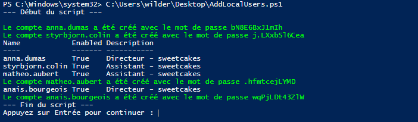
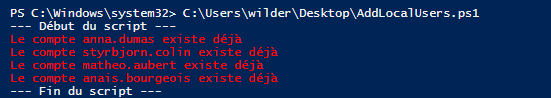

# Checkpoint 2

Ce dépôt contient les fichiers pour le Checkpoint 2, avec les solutions pour chaque exercice.

## Contenu du dépôt

- **Exercice 1.md** : fichier Markdown avec les réponses aux questions.

  [Checkpoint2_Exercice1.md](Exercice1.md)

- **Exercice 2.ps1** : Dossier qui contient 4 fichiers pour la partie scripting :

   [Partie_A_Contexte](Exercice2.ps1/A_Contexte_Q.2.1.md)  
 
   [Partie_B_Pratique_Script_principal](Exercice2.ps1/B_Pratique_Script_principal.md)  
 
   [Partie C_Pratique_Script_secondaire](Exercice2.ps1/C_Pratique_Script_secondaire.md)  
 
   [Code_du_script_corrigé_fonctionnel](Exercice2.ps1/AddLocalUsers.ps1)  

  
  
    

- **Exercice 3** : fichier Markdown avec les réponses aux questions.

   [Checkpoint2_Exercice3.md](Exercice3.md)
